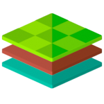

  
  <h3 align="center">app.decent.land</h3>
  
🐊 the alligator of the Permaweb 🐊

## Synopsis
This repository is about the FrontEnd of [app.decent.land](https://app.decent.land/explore) -- the web3.0 protocols feeds aggregator.

## APIs Used
- weave-aggregator: [repo](https://github.com/decentldotland/weave-aggregator)
- Permacast API: [repo](https://github.com/Parallel-news/permacast-cache)

## Integrated Feeds
| feed name  | feed source |
| ------------- |:-------------:|
| Ardrive      | [ardrive.io](https://ardrive.io)     |
| ArweaveSaves     | -    |
| Permacast     | [permacast.dev](https://permacast.dev)     |
| Pianity       | [pianity.com](https://pianity.com/) |
| Koii Network  | [koi.rocks](https://koi.rocks/contents?layout=list&time=1w&sort=top) |

## License
This project is licensed under the [MIT license](./LICENSE).
